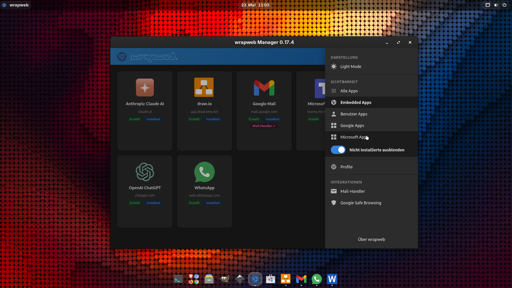

```
                                 __ 
 _    _________ ____ _    _____ / / 
| |/|/ / __/ _ `/ _ \ |/|/ / -_) _ \
|__,__/_/  \_,_/ .__/__,__/\__/_.__/🐧
              /_/                   
```
[](https://github.com/db0x/wrapweb)
[](LICENSE)
[](https://www.electronjs.org/)
[](https://github.com/db0x/wrapweb/actions/workflows/test.yml)

***Wrap any web app. Make it feel native.***

Turn any *web app* into a standalone Linux *desktop application* — packaged as an AppImage, with its own window, session, and taskbar entry.

Built on [Electron](https://www.electronjs.org/). Each app gets an isolated browser profile so WhatsApp, Teams, Google Earth and your own internal tools can all run side by side without interfering.

> **Target environment: GNOME on Wayland.**
> wrapweb is built and tested on GNOME/Wayland. Features like correct WM class, taskbar grouping, window management, and the Manager's native icon integration rely on GNOME and Wayland conventions. It may run on other desktops or X11, but expect rough edges.

## Installation

The quickest way to get started is the install script:

```bash
bash <(curl -fsSL https://raw.githubusercontent.com/db0x/wrapweb/main/install.sh)
```

> **curl not installed?** On Ubuntu 24.04 and newer, curl is no longer pre-installed.
> Install it first: `sudo apt install curl`

The script:
- checks for **Node.js ≥ 20** — if missing, offers to install it automatically via [nvm](https://github.com/nvm-sh/nvm)
- checks for **npm** — if missing, offers to install it via the system package manager
- checks for optional dependencies (FUSE, python3-gi, aspell) and prints install hints if any are absent
- clones the repository to `~/.local/share/wrapweb` (or a custom path passed as the first argument)
- runs `npm install`
- creates a `wrapweb` launcher entry in the application menu

Re-running the script on an existing installation does a `git pull` and reinstalls dependencies.

### Uninstall

```bash
~/.local/share/wrapweb/install.sh --uninstall
```

The script removes the desktop entry and icon, then asks interactively whether to also delete the installation directory and the app profile data (`~/.config/wrapweb/`).

### Manual setup

```bash
git clone https://github.com/db0x/wrapweb.git
cd wrapweb
npm install
npm start
```

## Features

- **Isolated sessions** — each app has its own persistent profile; cookies, storage and login state never bleed across apps
- **Native feel** — no browser chrome, correct WM class for taskbar grouping and window management
- **Context menu** — Cut / Copy / Paste + Save Image As; spelling suggestions via `aspell` (falls back to English); links show **Open with [App]** and **Open in browser** (with the system default browser icon) when a routing target is known
- **Cross-app link routing** — links to URLs handled by another installed wrapweb app open directly in that app instead of the system browser; a `routing.json` plugin file (written by `install-app`, read at runtime) maps hostnames to AppImages — no rebuild required when routing changes
- **Zoom** — `Ctrl+Scroll` per window
- **Screen sharing** — WebRTC / PipeWire capture works out of the box
- **DevTools** — `F12` to toggle
- **Single-instance enforcement** — optionally prevent a second window from opening; the existing window is focused and raised instead
- **System-wide protocol handlers** — register any app as the system's default `mailto:` handler; clicking a mail link anywhere on the desktop opens a compose window in the configured web app (Outlook, Gmail, …) — with no external mail client required
- **Private builds** — configs matching `webapps/build.private.*.json` are gitignored

## Manager

Running `npm start` (without a profile) opens the **wrapweb Manager** — a graphical overview of all configured apps. The Manager is the primary interface for adding, configuring, building, installing, and launching apps. The UI language follows the system locale (German and English supported).



### App cards

Each app is shown as a card with its icon, name, URL, and status badges. Hovering a card reveals a toolbar:

| Button | Action | Active when |
|---|---|---|
| Info | Shows all config values and filesystem paths | always |
| Build / Rebuild | Builds (or rebuilds) the AppImage | always |
| Install / Reinstall | Creates or overwrites the `.desktop` launcher entry — no rebuild required | built |
| Delete | Removes AppImage and `.desktop` file; profile data is kept | built |

Clicking the app icon directly **launches** the app — only if it is installed. Uninstalled apps show a grayed-out icon.

Only one build can run at a time; a full-screen overlay blocks other actions while a build is in progress.

### Info dialog

The info button opens a dialog showing every configured value for that app: URL, profile, icon, window geometry, user-agent, internal domains, and Cross-Origin Isolation. If the app is built, the AppImage path and profile directory are shown with **Open in file manager** buttons.

### Delete

For **user apps** (added via the Manager or private JSON configs), the delete dialog offers an additional toggle to also remove the configuration file. Without it, the card reappears on next launch and the app can be rebuilt.

### Adding a new app

Click the **+** card at the end of the grid to open the **Create App** dialog. All configuration options are available from within the Manager:

| Field | Notes |
|---|---|
| Profile | Unique identifier — lowercase letters, digits and hyphens; checked for uniqueness live |
| Name | Optional display name (derived from profile if left empty) |
| URL | The URL loaded on startup |
| Icon | Opens a searchable icon picker showing all icons available in the system's GNOME icon theme |
| Width / Height | Initial window size (optional) |
| User-Agent | Choose from presets or leave empty for the default Electron UA |
| Internal domains | Extra domains that open inside the app window (e.g. OAuth redirects) — added one by one via the list widget |
| Cross-Origin Isolation | Enables `SharedArrayBuffer` — required for multi-threaded WASM |
| Single instance | Prevent more than one window of this app from opening at the same time |

New apps are saved as `webapps/build.private.<profile>.json` and are gitignored automatically.

### Side menu

The menu (top right) offers:

- **Light / Dark mode** toggle — preference is saved across sessions
- **Visibility filter** — All Apps / Embedded Apps / User Apps
- **Hide uninstalled** — suppress apps that haven't been installed yet

## System mail handler

wrapweb can register any web mail app as the system-wide default handler for `mailto:` links. Once registered, clicking a `mailto:` link in any application — browser, PDF viewer, terminal, Teams, … — opens a compose window in the configured web app. No native mail client required.

### How it works

The app's `.desktop` file declares `MimeType=x-scheme-handler/mailto`, which makes it available as a handler. When the app is installed via the Manager, a prompt asks whether it should also become the **active default**. Confirming sets the system preference via `xdg-mime default`.

The `mailto:` URL is converted to the web app's compose URL before loading. Each provider uses its own format — this is configured via `mailtoTemplate` and an optional `mailtoParamMap` in the app config (see [Config reference](#config-reference)).

The Manager displays a **Mail handler** badge on every app capable of handling `mailto:` links. The currently active default is highlighted with a **✓**. Installing any other mail-capable app and choosing to set it as default automatically transfers the role.

### Included mail-capable apps

| Config | App | Compose URL base |
|---|---|---|
| `build.outlook.json` | Microsoft Outlook | `https://outlook.cloud.microsoft/mail/deeplink/compose` |
| `build.google-mail.json` | Google Mail | `https://mail.google.com/mail/?view=cm&fs=1` |

`mailtoParamMap` is optional — use it when the provider expects different query parameter names than the standard `mailto:` fields (`to`, `subject`, `body`, `cc`, `bcc`).

## File handler apps

Some web apps can act as the system-wide handler for a file type — so double-clicking a file in Nautilus opens it directly in the wrapped app.

### draw.io

`build.drawio.json` wraps [app.diagrams.net](https://app.diagrams.net) and registers itself as the handler for `.drawio`, `.drawio.svg`, and `.drawio.png` files.

After installing, double-clicking any of these files in the file manager opens it directly in the app with the correct filename shown in the title bar. **Save** (`Ctrl+S`) and **Save As** work natively through the system file dialog — the file is written to disk just like in a native app.

| Format | MIME type | Notes |
|---|---|---|
| `.drawio` | `application/x-drawio` | Native XML diagram format |
| `.drawio.svg` | `application/x-drawio-svg` | SVG export with embedded diagram XML |
| `.drawio.png` | `application/x-drawio-png` | PNG export with embedded diagram XML |

## Included app configs

| Config | App |
|---|---|
| [`build.claude.json`](webapps/build.claude.json) | Claude (Anthropic) |
| [`build.drawio.json`](webapps/build.drawio.json) | draw.io |
| [`build.google-docs.json`](webapps/build.google-docs.json) | Google Docs |
| [`build.google-drive.json`](webapps/build.google-drive.json) | Google Drive |
| [`build.google-earth.json`](webapps/build.google-earth.json) | Google Earth |
| [`build.google-gemini.json`](webapps/build.google-gemini.json) | Google Gemini |
| [`build.google-mail.json`](webapps/build.google-mail.json) | Google Mail |
| [`build.google-notes.json`](webapps/build.google-notes.json) | Google Keep |
| [`build.google-presentation.json`](webapps/build.google-presentation.json) | Google Presentation |
| [`build.google-spreadsheets.json`](webapps/build.google-spreadsheets.json) | Google Spreadsheets |
| [`build.openai.json`](webapps/build.openai.json) | OpenAI ChatGPT |
| [`build.excel.json`](webapps/build.excel.json) | Microsoft Excel |
| [`build.outlook.json`](webapps/build.outlook.json) | Microsoft Outlook |
| [`build.powerpoint.json`](webapps/build.powerpoint.json) | Microsoft PowerPoint |
| [`build.teams.json`](webapps/build.teams.json) | Microsoft Teams |
| [`build.word.json`](webapps/build.word.json) | Microsoft Word |
| [`build.whatsapp.json`](webapps/build.whatsapp.json) | WhatsApp |

## Requirements

- **git** — required by `install.sh` to clone and update the repository
- **Node.js ≥ 20**
- **Linux** (GNOME/Wayland recommended — see note above)
- **FUSE** — required to run AppImages (`sudo apt install fuse` or `fuse3`)
- **python3-gi** — GTK bindings used by the Manager to resolve and enumerate system icon theme icons (`sudo apt install python3-gi`)
- **gtk-update-icon-cache** and **update-desktop-database** — called after installing an app; usually already present via `libgtk-3-bin` and `desktop-file-utils`
- **aspell** — spell-check suggestions in text fields (optional; `sudo apt install aspell-de` for German, etc.)

## Libraries

| Library | Used for |
|---|---|
| [Electron](https://www.electronjs.org/) | App shell, renderer, IPC |
| [electron-builder](https://www.electron.build/) | AppImage packaging |
| [OverlayScrollbars](https://github.com/KingSora/OverlayScrollbars) | Native-style overlay scrollbars in the Manager |
| [Papirus Icon Theme](https://github.com/PapirusDevelopmentTeam/papirus-icon-theme) | Some icons in the Manager. |

## Building AppImages via CLI

The Manager handles build and install for most cases. For scripted or headless workflows, the CLI scripts remain available:

```bash
npm run build                        # build all configs
npm run build -- whatsapp            # build a single app
npm run build -- private.myapp

npm run install-app -- whatsapp      # (re-)install launcher entry without rebuilding
npm run install-app                  # all configs
```

Output lands in `dist/` as a self-contained AppImage.

## Manual config (advanced)

Apps can also be configured by placing a JSON file in the project root. This is useful for bulk setup, version-controlled shared configs, or options not yet exposed in the Manager UI.

App configs live in the `webapps/` directory. For apps you don't want to commit, use `webapps/build.private.<name>.json` — it is gitignored automatically.

### Config reference

| Field | Type | Description |
|---|---|---|
| `profile` | string | **Required.** Unique identifier — used for the session, userData path, and app IDs |
| `url` | string | **Required.** URL to load on startup |
| `name` | string | Human-readable display name (default: derived from `profile`) |
| `icon` | string | Icon name resolved from the system icon theme |
| `userAgent` | string | Override the user-agent string |
| `geometry.width/height` | number | Initial window size (default: 1280 × 1024) |
| `geometry.x/y` | number | Initial window position — _deprecated will be removed with remove of x11 in Gnome_ |
| `internalDomains` | string \| array | Extra domains allowed to open inside the app window (e.g. OAuth providers) |
| `crossOriginIsolation` | boolean | Enable `SharedArrayBuffer` — required for multi-threaded WASM (Google Earth) |
| `singleInstance` | boolean | Allow only one running instance; a second launch focuses the existing window instead |
| `mimeTypes` | array | Protocol schemes or MIME types this app can handle (e.g. `["x-scheme-handler/mailto"]` or `["application/x-drawio"]`) |
| `mimeExtensions` | object | Maps MIME types to file extensions for system registration (e.g. `{ "application/x-drawio": ["drawio"] }`) — triggers `update-mime-database` on install |
| `mimeIcons` | object | Maps MIME types to SVG asset filenames (from `assets/`) installed as system file-type icons (e.g. `{ "application/x-drawio": "application-vnd.x-drawio.svg" }`) |
| `fileHandler` | boolean | Enable local file handling — files passed via the system (e.g. double-click in Nautilus) are read and passed to the app; also grants the `fileSystem` permission required for the File System Access API |
| `mailtoTemplate` | string | Base URL for the compose window — `mailto:` parameters are appended as a query string |
| `mailtoParamMap` | object | Rename `mailto:` parameters before appending (e.g. `{ "subject": "su" }` for Gmail) |
| `mailtoJs` | string | JavaScript injected after page load to open compose — use `{to}`, `{subject}`, `{body}`, `{cc}`, `{bcc}` as placeholders; for web apps that open compose via JS API rather than URL routing (e.g. Open-Xchange / Strato) |

### Examples

```json
{ "profile": "google-docs", "url": "https://docs.google.com" }
```

```json
{
    "profile": "claude",
    "name": "Claude",
    "icon": "claude",
    "url": "https://claude.ai",
    "internalDomains": ["accounts.google.com", "github.com"]
}
```

```json
{
    "profile": "google-earth",
    "url": "https://earth.google.com",
    "crossOriginIsolation": true,
    "userAgent": "Mozilla/5.0 (X11; Linux x86_64) AppleWebKit/537.36 (KHTML, like Gecko) Chrome/142.0.0.0 Safari/537.36"
}
```

## Session data

Each app stores cookies, localStorage and cache under:

```
~/.config/wrapweb/<profile>/
```

Profiles are fully isolated and persist across restarts.
